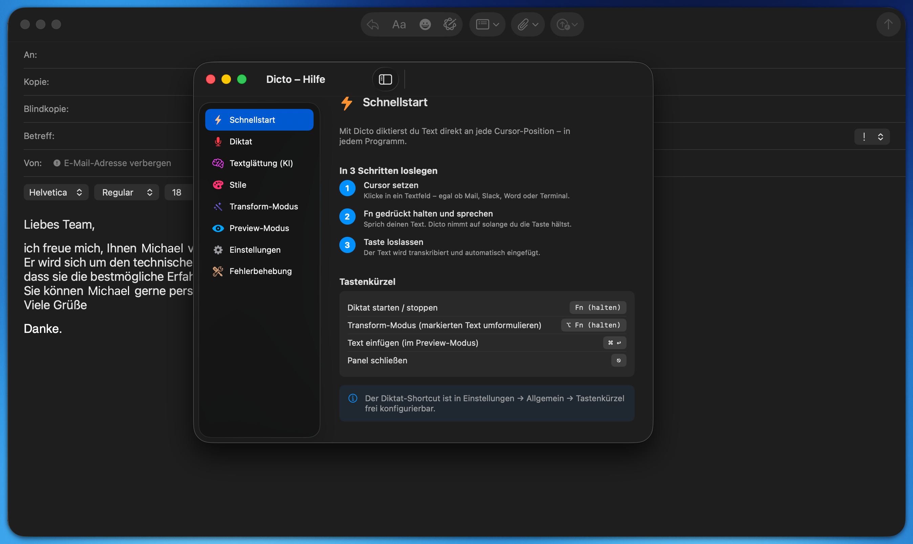
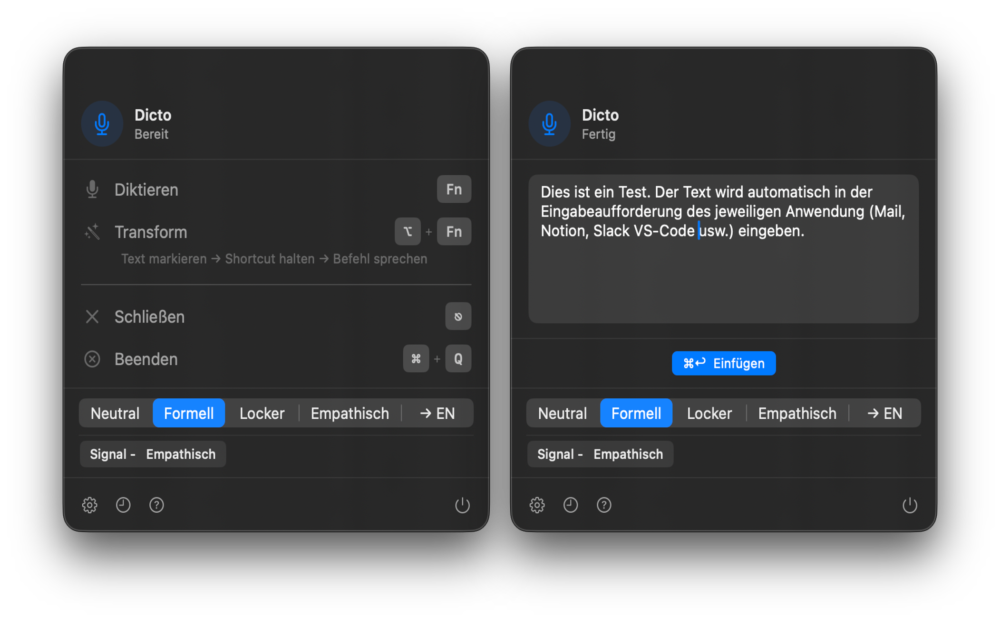
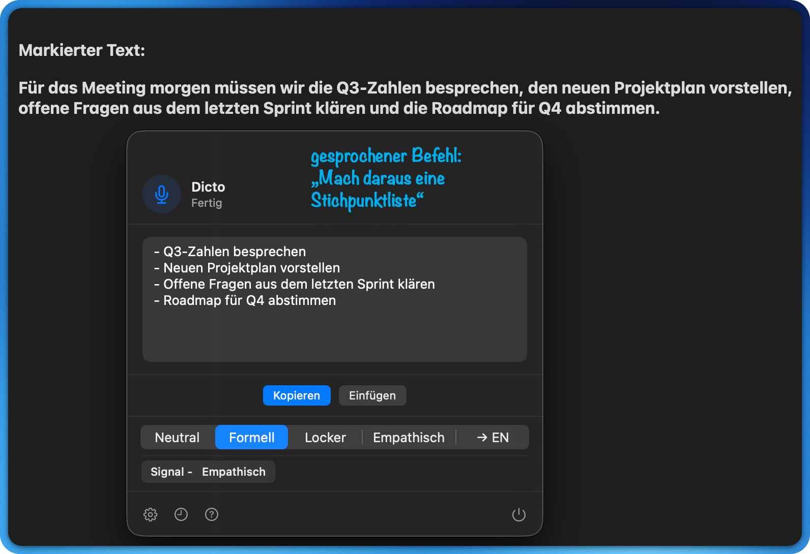

# Dicto

**Dictation for macOS. Fully local. No subscription. No cloud.**

Most dictation apps send your voice to a server. Dicto doesn't.  
Hold a key, speak, release — your words appear at the cursor, processed entirely on your Mac.



---

## Download

**[⬇ Download Dicto 0.1.0](https://github.com/Dok100/Dicto/releases/download/v0.1.0/Dicto-0.1.0.dmg)** — macOS 14.0+, Apple Silicon

Open the DMG, drag Dicto to Applications, launch it. That's it.

> [All releases](https://github.com/Dok100/Dicto/releases) · [⭐ Star this repo](../../stargazers)

---

## Why Dicto

The dictation app market is full. Here is why Dicto is different:

| | Dicto | SuperWhisper | Wispr Flow | Apple Dictation |
|---|---|---|---|---|
| Fully local processing | ✅ | Partial | ❌ | Partial |
| No subscription | ✅ | ❌ €8/mo | ❌ €15/mo | ✅ |
| AI text smoothing | ✅ | ✅ | ✅ | ❌ |
| Transform existing text | ✅ | ❌ | ❌ | ❌ |
| Open source | ✅ | ❌ | ❌ | ❌ |
| API key in Keychain | ✅ | unknown | unknown | — |

**The core promise:** professional-quality dictation with AI — without your words ever leaving your Mac.

---

## Who it is for

Dicto is built for people who care about **what happens to their data**:

- 🏥 **Doctors, lawyers, therapists** — confidential content that must not touch a cloud
- 📝 **Journalists, researchers, writers** — sensitive sources and drafts
- 🔐 **Privacy-conscious professionals** — tired of every app wanting cloud access
- 💸 **Subscription-fatigued users** — one app that just works, no monthly fee

---

## How it works

Dicto sits in your menu bar. Works in any app — Mail, Notion, Slack, Notes, VS Code, Terminal, MS-Office.




**Three modes:**

### 🎤 Dictate
Hold your dictation key → speak → release. Text is inserted at the cursor.  
Optional: AI smoothing removes filler words and corrects grammar automatically.

### ✨ Transform
Select text in any app → hold `⌥ Fn` → speak your instruction.

> *"Make this more formal"*  
> *"Translate to English"*  
> *"Shorten to two sentences"*  
> *"Fix the grammar"*

**No other dictation app on macOS does this.**




### 👁 Preview
See the result before it's inserted. Edit inline, confirm with `⌘ ↩`.  
Corrections are remembered in a personal dictionary — Dicto learns your vocabulary.

---

## Privacy in detail

| What | Where it stays |
|------|---------------|
| Your voice recordings | On your Mac, deleted after transcription |
| Transcribed text | On your Mac |
| AI processing (Ollama) | On your Mac |
| AI processing (OpenAI) | OpenAI's servers — **opt-in only, clearly labeled** |
| Your OpenAI API key | macOS Keychain — encrypted, never written to disk |
| Settings & history | On your Mac (UserDefaults) |

Full details: [docs/PRIVACY.md](docs/PRIVACY.md)

---

## Features

### Two transcription engines

| | Apple Speech | Whisper (recommended) |
|---|---|---|
| Download | None | ~800 MB, one-time |
| Speed | Live, word by word | Result after recording |
| Quality | Good for everyday speech | Excellent — handles jargon, names, umlauts |
| Offline | Yes | Yes |

### AI text smoothing

Raw dictation gets cleaned up: filler words removed, grammar fixed, tone adjusted.  
Choose your AI backend:

- **Ollama (local)** — fully private, free, runs on your Mac
- **OpenAI API** — faster, ~€0.01/day, opt-in

### Styles

| Style | Use case |
|-------|----------|
| Neutral | Clean, direct — general purpose |
| Formal | Emails, reports, business writing |
| Casual | Slack, WhatsApp, quick notes |
| Empathetic | Feedback, sensitive conversations |
| → EN | Dictate in German, get English output |
| Custom | Define your own prompt (e.g. "Medical letter", "Meeting notes") |

---

## Requirements

- macOS 14.0 (Sonoma) or later
- Apple Silicon (M1 or newer)
- Microphone permission
- Accessibility permission (for automatic text insertion)

---

## Build from source

```bash
# Install dependencies
brew install xcodegen swiftformat

# Clone and run
git clone https://github.com/Dok100/Dicto.git
cd Dicto
make generate    # Generate Xcode project from project.yml
make install-app # Build and install to /Applications
```

Optional — local AI with Ollama:
```bash
brew install ollama
ollama pull qwen2.5:14b   # lighter option (~8 GB RAM)
ollama pull qwen2.5:32b   # best quality (~20 GB RAM)
```

---

## License

MIT — free to use, modify, and distribute.

---

## Support

Dicto is free and open source. If it saves you time or protects your privacy, consider supporting development:

<!-- GUMROAD BADGE PLACEHOLDER -->
> 💛 [Pay what you want](#) *(link coming soon)*

This covers OpenAI API costs and keeps the project going.

---

*Built with [WhisperKit](https://github.com/argmaxinc/WhisperKit) · Runs on Apple Silicon · Made in Germany 🇩🇪*
